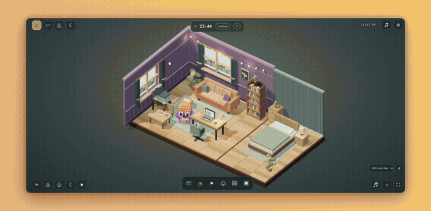

# Pixo, a PageLove companion template

Fork a cozy 3D companion, edit one configuration file, and deploy it to PageLove. Includes focus, care, private memories, and friendly small talk—no AI API key, database, or account system needed for the core experience.

[Try the live Pixo companion](https://heat-flip-3234.onpagelove.com/) · [Read the template guide](./TEMPLATE_GUIDE.md)

**Start here:** [Make your own companion on PageLove](./PAGELOVE_QUICKSTART.md). Choose a study-buddy or wellbeing example, customize `pixo.config.js`, and run `npm run package:pagelove` for an upload-ready ZIP.

[](./assets/final_video.mp4)

[Watch the full demo with sound](./assets/final_video.mp4) · Animated preview plays at 3× speed.

## Why this template is useful

Pixo gives makers a polished starting point for study buddies, wellness companions, focus tools, classroom helpers and gentle personal dashboards. A visitor’s tasks, check-ins, preferences, progress and reminders are saved as private PageLove session state—no backend code or database setup required.

Included out of the box:

- A fullscreen 3D voxel home with workspace, dining area, bedroom, soft shadows, warm lamps, and animated fish
- Four smooth camera views and icon-only game controls; Pixo walks, types, eats with a spoon, drinks, waters his plant, and lies down to sleep
- Clickable furniture and keyboard-accessible activity buttons; adjustable daylight, golden hour, night, and pixel rendering
- Water and meal reminders trigger shared-activity animations; bedtime follows the device clock or your sleep button
- Key-free small talk by default: typed greetings, friendly scripted replies, browser read-aloud, and optional tap-to-speak input
- Optional advanced WebRTC AI voice client and protected server (only this advanced mode needs credentials)
- Optional Brave/Chrome Focus Shield extension for Twitter/X, LinkedIn, YouTube, and Instagram (requires installation and opt-in)
- A first-meeting introduction, daily quest, editable diary, user-controlled memories, and keepsakes earned through time and care
- Focus timer, daily plan, streaks, XP, levels, mood check-ins, and a memory timeline
- Configurable water and meal reminders with browser notifications and an on-screen Pixo pop-up
- Daily hydration goal, one-click water logging, and a live countdown to the next care moment
- Responsive desktop and mobile UI, ambient focus sound, and reduced-motion support
- Session-private persistence powered by PageLove `PUT`, `POST`, and `DELETE` capabilities
- A small build with a pinned, self-hosted Three.js renderer, contract tests, safe WebDAV deploy script, and two ready-made examples
- Optional native macOS menu-bar companion in `desktop/PixoDesktop`

## Start in two minutes

```bash
git clone https://github.com/pixawna/pixoworld.git
cd pixoworld
npm ci
npm test
npm run dev
```

Open `http://localhost:4173`. Local previews use browser storage; deployed versions use private PageLove session state.

## Make it yours

Most variants only need one file: [`pixo.config.js`](./pixo.config.js).

```js
window.PIXO_TEMPLATE = Object.freeze({
  id: "my-companion",
  companion: {
    name: "Pixo",
    browserTitle: "Pixo — your tiny work companion",
    heroTitle: "Let’s make today\nfeel a little lighter.",
    heroMessage: "I’ve got the small things. You bring the big ideas.",
    firstWords: "You’ve got this!",
    greetings: ["I’m right here. ♡", "Tiny steps still count! ✦"],
  },
  appearance: {
    accent: "#ffcc58",
    accentSoft: "#fff1bf",
    companionGlow: "rgba(122, 91, 224, 0.24)",
  },
  focus: { defaultMinutes: 25, options: [15, 25, 45, 60] },
  care: { waterTimes: ["10:30", "13:00", "15:30"], mealTime: "17:00", waterGoal: 8 },
  starterTasks: ["Choose today’s main thing", "Drink a glass of water", "Take a quiet stretch break"],
  talk: {
    welcome: "Hi, I’m {companion}. How’s your day?",
    prompts: ["Hi {companion}", "I’m tired", "Tell me a joke"],
    readAloud: true,
    showAdvancedAI: false,
    replies: { hello: ["Hello, friend! Want to sit together for a moment?"] },
  },
});
```

The room and voxel character are built from geometry in `room-scene.js`; replacing an image does not change the 3D character. `room.css` controls the room interface, while `pixo.config.js` configures the existing focus, care, and profile tools. `assets/pixo_2d.png` remains the artwork for browser reminder cards and the optional desktop companion.

Try a prepared direction:

```bash
npm run use-example -- study-buddy
npm run use-example -- wellbeing
```

See [`TEMPLATE_GUIDE.md`](./TEMPLATE_GUIDE.md) for the full customization contract.

## How PageLove powers it

This is intentionally plain HTML, CSS, and JavaScript. `index.html` loads PageLove’s documented live-update and element-method clients, marks private state with `p:transient`, and declares selector-scoped authorization rules.

- `PUT()` updates profile, focus, growth, check-in, hydration, individual tasks, and room state (diary, memories, keepsakes, and preferences).
- `POST()` appends tasks and memory entries.
- `DELETE()` removes individual task and memory elements.
- `/*` covers both `/` and `/index.html`, while write access stays restricted to transient state.

Every browser gets its own server-backed transient state. The canonical template remains unchanged, so one visitor cannot overwrite another visitor’s companion data. Local storage is only a development fallback and a one-time migration path for earlier versions.

This is session memory, not an account or cross-device backup. Keep the page open for web reminders; browser notifications require permission. Talk opens key-free scripted small talk, not open-ended AI. Chat stays in tab memory, clears on reload, and is not automatically saved to PageLove. Optional microphone input depends on browser support and may use an online speech service; typed replies need no AI service. Only advanced AI voice needs a protected server; API keys never belong in this frontend. Blocking other websites needs the installed focus extension—it is not something PageLove alone can enforce. See [voice and focus setup](./SETUP_VOICE_AND_FOCUS.md) for requirements, privacy, and limits.

The implementation follows PageLove’s [JavaScript guide](https://docs.pagelove.com/languages/javascript/), [transient elements reference](https://docs.pagelove.com/reference/composing-pages/Transient-Elements/), and [authorization rules](https://docs.pagelove.com/reference/permissions/AuthorizationRule/).

## Project layout

```text
.
├── pixo.config.js          # one-file companion customization
├── index.html              # UI, transient state, and PageLove permissions
├── app.js                  # focus, care, memories, and persistence
├── room-scene.js           # real-time voxel geometry, lighting, and animation
├── room-life.js            # room interactions and PageLove persistence bridge
├── room-model.js           # dates, room state, and keepsake milestones
├── room.css                # room layout, dialogs, and mobile presentation
├── game.css                # fullscreen game HUD and icon-only controls
├── small-talk.js           # local scripted replies and browser speech controls
├── small-talk-panel.js     # default no-setup conversation UI
├── voice-client.js         # optional advanced WebRTC microphone and reply audio
├── server/                 # protected voice server, never in the public build
├── extension/focus-shield/ # optional browser website blocking
├── styles.css              # responsive design and companion animation
├── assets/                 # replaceable character artwork
├── examples/               # study-buddy and wellbeing configurations
├── desktop/PixoDesktop/    # optional native macOS companion
├── scripts/                # build, deploy, and example-switching tools
└── test/                   # configuration and PageLove contract tests
```

## Deploy to PageLove

Create a host in the [PageLove console](https://console.pagelove.com/console/), then:

```bash
cp .env.example .env
# Add your WebDAV URL, public URL, and API key to .env
npm run deploy:dry
npm run deploy
```

`.env` and `.apikey` are ignored by Git. Deployment uses conditional WebDAV writes to avoid silently overwriting concurrent changes and uploads `index.html` last.

To upload manually, run `npm run package:pagelove`, extract `artifacts/pixo-pagelove-template.zip`, and upload its contents to the PageLove host root. Alternatively, upload the contents of `dist/` after `npm run build`. Verify both the root route and an interaction such as logging a glass of water. No AI key is needed; scripted deployment uses only the owner's PageLove deployment credential.

The build includes key-free small talk and a downloadable extension ZIP (requires the `zip` utility), but deliberately excludes `server/` and all environment files. No voice server is needed for small talk. For optional advanced AI voice, deploy the server separately and follow [SETUP_VOICE_AND_FOCUS.md](./SETUP_VOICE_AND_FOCUS.md).

## Optional macOS companion

Run `desktop/PixoDesktop/install.sh` to build and install the menu-bar companion for the current macOS user. It uses the original 2D character in a floating desktop reminder card, can snooze reminders, and can start at login. Its reminder settings are separate from the website; the new 3D room runs in the browser.

## License

[MIT](./LICENSE) — fork it, give your companion a personality, and make something kind.
