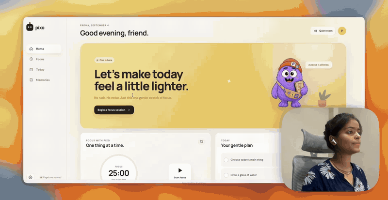

# Pixo, a PageLove companion template

Build a tiny digital companion that helps people focus, remember their day and care for themselves—without a database, framework, or account system.

[Try the live Pixo companion](https://heat-flip-3234.onpagelove.com/) · [Read the template guide](./TEMPLATE_GUIDE.md)



## Why this template is useful

Pixo gives makers a polished starting point for study buddies, wellness companions, focus tools, classroom helpers and gentle personal dashboards. A visitor’s tasks, check-ins, preferences, progress and reminders are saved as private PageLove session state—no backend code or database setup required.

Included out of the box:

- An animated, keyboard-accessible companion with configurable name, copy, colors, and greetings
- Focus timer, daily plan, streaks, XP, levels, mood check-ins, and a memory timeline
- Configurable water and meal reminders with browser notifications and an on-screen Pixo pop-up
- Daily hydration goal, one-click water logging, and a live countdown to the next care moment
- Responsive desktop and mobile UI, ambient focus sound, and reduced-motion support
- Session-private persistence powered by PageLove `PUT`, `POST`, and `DELETE` capabilities
- A dependency-free build, contract tests, safe WebDAV deploy script, and two ready-made examples
- Optional native macOS menu-bar companion in `desktop/PixoDesktop`

## Start in two minutes

```bash
git clone https://github.com/pixawna/pixoworld.git
cd pixoworld
npm test
npm run dev
```

Open `http://localhost:4173`. Local previews use browser storage; deployed versions use private PageLove session state.

## Make it yours

Most variants only need one file: [`pixo.config.js`](./pixo.config.js).

```js
window.PIXO_TEMPLATE = Object.freeze({
  id: "my-companion",
  companion: {
    name: "Pixo",
    browserTitle: "Pixo — your tiny work companion",
    heroTitle: "Let’s make today\nfeel a little lighter.",
    heroMessage: "I’ve got the small things. You bring the big ideas.",
    firstWords: "You’ve got this!",
    greetings: ["I’m right here. ♡", "Tiny steps still count! ✦"],
  },
  appearance: {
    accent: "#ffcc58",
    accentSoft: "#fff1bf",
    companionGlow: "rgba(122, 91, 224, 0.24)",
  },
  focus: { defaultMinutes: 25, options: [15, 25, 45, 60] },
  care: { waterTimes: ["10:30", "13:00", "15:30"], mealTime: "17:00", waterGoal: 8 },
  starterTasks: ["Choose today’s main thing", "Drink a glass of water", "Take a quiet stretch break"],
});
```

Replace `assets/pixo_2d.png` to bring your own character. Motion, focus states, reminder cards, and responsive sizing are already handled by the template.

Try a prepared direction:

```bash
npm run use-example -- study-buddy
npm run use-example -- wellbeing
```

See [`TEMPLATE_GUIDE.md`](./TEMPLATE_GUIDE.md) for the full customization contract.

## How PageLove powers it

This is intentionally plain HTML, CSS, and JavaScript. `index.html` loads PageLove’s documented live-update and element-method clients, marks private state with `p:transient`, and declares selector-scoped authorization rules.

- `PUT()` updates profile, focus, growth, check-in, hydration, and individual tasks.
- `POST()` appends tasks and memory entries.
- `DELETE()` removes individual task and memory elements.
- `/*` covers both `/` and `/index.html`, while write access stays restricted to transient state.

Every browser gets its own server-backed transient state. The canonical template remains unchanged, so one visitor cannot overwrite another visitor’s companion data. Local storage is only a development fallback and a one-time migration path for earlier versions.

The implementation follows PageLove’s [JavaScript guide](https://docs.pagelove.com/languages/javascript/), [transient elements reference](https://docs.pagelove.com/reference/composing-pages/Transient-Elements/), and [authorization rules](https://docs.pagelove.com/reference/permissions/AuthorizationRule/).

## Project layout

```text
.
├── pixo.config.js          # one-file companion customization
├── index.html              # UI, transient state, and PageLove permissions
├── app.js                  # focus, care, memories, and persistence
├── styles.css              # responsive design and companion animation
├── assets/                 # replaceable character artwork
├── examples/               # study-buddy and wellbeing configurations
├── desktop/PixoDesktop/    # optional native macOS companion
├── scripts/                # build, deploy, and example-switching tools
└── test/                   # configuration and PageLove contract tests
```

## Deploy to PageLove

Create a host in the [PageLove console](https://console.pagelove.com/console/), then:

```bash
cp .env.example .env
# Add your WebDAV URL, public URL, and API key to .env
npm run deploy:dry
npm run deploy
```

`.env` and `.apikey` are ignored by Git. Deployment uses conditional WebDAV writes to avoid silently overwriting concurrent changes and uploads `index.html` last.

To upload manually, run `npm run build` and upload the contents of `dist/` to the PageLove host. Verify both the root route and an interaction such as logging a glass of water.

## Optional macOS companion

Run `desktop/PixoDesktop/install.sh` to build and install the menu-bar companion for the current macOS user. It can show the same character in a floating desktop reminder card, snooze reminders, and start at login. Reminder times can be changed from its menu-bar settings.

## License

[MIT](./LICENSE) — fork it, give your companion a personality, and make something kind.
